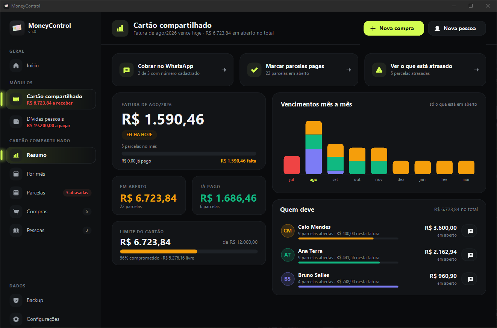
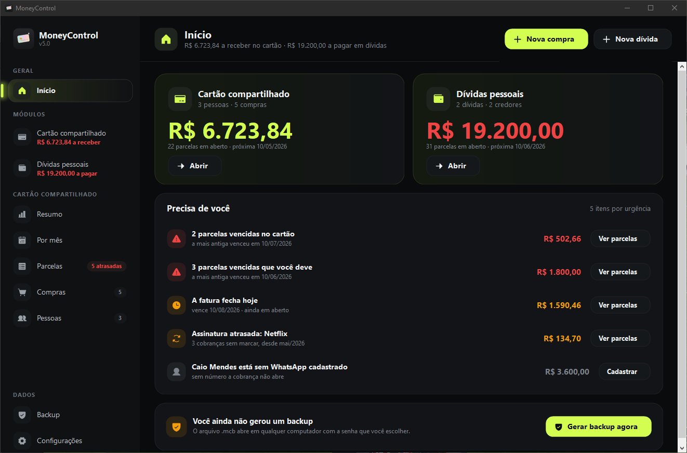
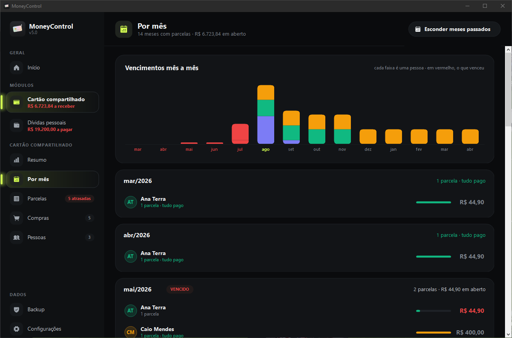
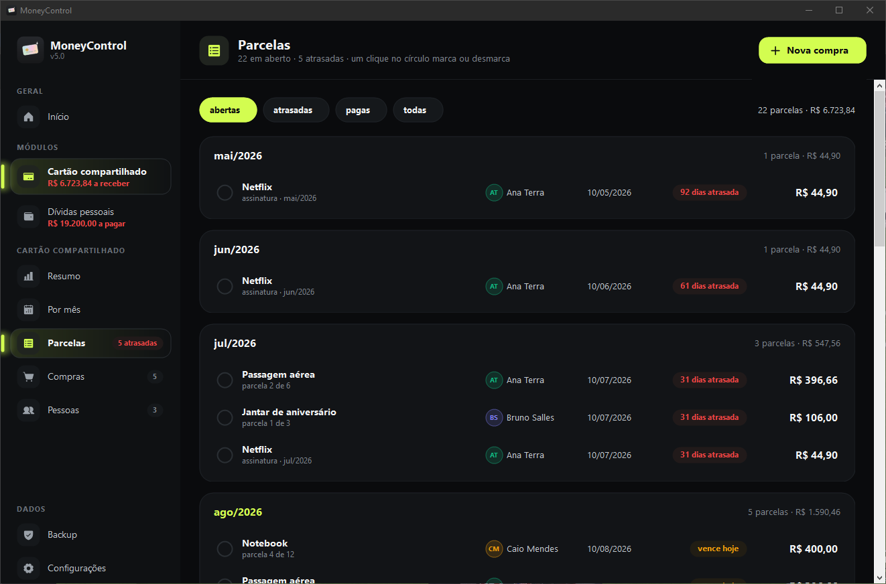

<h1 align="center">MoneyControl</h1>

<p align="center">
  Cartão compartilhado e dívidas pessoais, num programa só.<br>
  Roda offline, no seu computador, com os dados criptografados.
</p>

<p align="center">
  
  
  
  
</p>

<p align="center">
  
</p>

---

## Baixar

1. Baixe o **`MoneyControl.exe`** em [Releases](../../releases).
2. Rode.

É isso. Um arquivo, sem instalador, sem cadastro, sem senha, sem configuração inicial.
Nada de servidor, nada de conta, nada de nuvem.

Precisa do .NET Framework 4.x, que já vem no Windows 8 ou mais novo.

---

## O que ele faz

<table>
<tr>
<td width="50%" valign="top">

### 💳 Cartão compartilhado

Você passa o cartão, várias pessoas usam. O programa lança as compras por pessoa,
divide as parcelas, mostra a fatura do mês e diz quanto cada um te deve — com um
botão que já abre a cobrança pronta no WhatsApp.

</td>
<td width="50%" valign="top">

### 🏦 Dívidas pessoais

O outro lado: o que **você** deve, para quem, em quantas parcelas e quando vence.
Progresso de quitação por credor, parcelas atrasadas em vermelho, e o total que
falta para ficar livre.

</td>
</tr>
</table>

Os dois módulos vivem no mesmo programa e no mesmo backup.

<p align="center">
  
</p>

### Parcelas que fecham no centavo

Dividir R$ 100 em 3 não dá 33,33 três vezes. A última parcela absorve a sobra, então a
soma sempre bate com o total. `31/01 + 1 mês` vira `28/02`, e `29/02` em ano bissexto.

### Assinaturas que não viram lista infinita

Marque `É uma assinatura` e o lançamento se repete todo mês, sem fim. Para não gerar
parcelas até o fim dos tempos, ele só cria **até o mês atual** — a cada mês que passa,
aparece mais uma. O campo *até* encerra a assinatura sem apagar o histórico do que já
foi pago.

### Vencimentos mês a mês

Um gráfico de barras empilhadas por pessoa e, abaixo, um cartão por mês com quanto falta
de cada um. Mês vencido sai inteiro em vermelho; o mês atual, no acento.

<p align="center">
  
</p>

### Parcelas agrupadas por mês

Um clique no círculo da linha marca ou desmarca como paga. Cada mês é um cartão com a
contagem e a soma; o filtro em pílula troca entre abertas, atrasadas, pagas e todas.

<p align="center">
  
</p>

---

## Seus dados

Ficam **só no seu computador**, num arquivo em `%LOCALAPPDATA%\MoneyControl\dados.bin`.

| | |
|---|---|
| No disco | um arquivo só, cifrado inteiro; nenhum campo em texto legível |
| Proteção | DPAPI do Windows, escopo `CurrentUser` |
| Chave | o Windows guarda, derivada das credenciais da sua conta |
| Gravação | escreve num temporário e troca pelo bom — queda de energia não deixa você sem nada |

Não existe arquivo de chave para alguém copiar: quem protege é o Windows.

### O que isso protege — e o que não

**Protege:** quem copiar o `dados.bin` para outro computador não abre nada. Outro usuário
do mesmo Windows também não. Seu backup roubado não abre. Ninguém lê seus dados olhando
os arquivos.

**Não protege** contra um programa malicioso rodando **na sua própria conta do Windows**,
com você logado. Ele pediria os dados ao DPAPI exatamente como o MoneyControl faz. Isso não
é um defeito deste programa: qualquer app que abre sozinho, sem pedir senha, tem esse
limite — a chave precisa estar ao alcance dele, logo ao alcance de quem roda como você.

Se você quer proteção **também** nesse cenário, o preço é digitar uma senha toda vez que
abrir. Aqui a escolha foi abrir sem atrito. O backup, esse sim, tem senha.

### Backup

**Configurações → Backup criptografado** gera um `.mcb` protegido por uma **senha que você
escolhe na hora** — não pela chave da máquina. Isso é de propósito: um backup que só abre
neste Windows não serviria de nada justamente no dia em que o computador morre.

| | |
|---|---|
| Derivação | PBKDF2-SHA256, 310.000 iterações, salt aleatório |
| Cifra | AES-256-CBC |
| Autenticação | HMAC-SHA256 sobre salt+IV+cifrado (encrypt-then-MAC) |

Adulterar qualquer byte do arquivo faz a abertura falhar em vez de devolver lixo. Guarde a
senha: sem ela o arquivo não abre, e não há recuperação.

Existe também *exportar sem criptografia* (`.json`), para levar os dados para uma
planilha. Esse arquivo abre em qualquer editor — trate como documento sensível.

> Apagar `%LOCALAPPDATA%\MoneyControl` apaga tudo. Faça backup.

---

## Compilar do código

Sem projeto, sem NuGet, sem dependência a instalar: nove arquivos e o compilador que já vem
no Windows, em `C:\Windows\Microsoft.NET\Framework64\v4.0.30319\`.

```bat
csc /target:winexe /out:MoneyControl.exe /win32icon:docs\moneycontrol.ico ^
    /reference:System.dll /reference:System.Core.dll ^
    /reference:System.Drawing.dll /reference:System.Windows.Forms.dll ^
    /reference:System.Security.dll /reference:System.Web.Extensions.dll ^
    src\*.cs
```

| | |
|---|---|
| `src\Modelo.cs` | dados e cálculo — parcelas, assinaturas, totais. Sem UI. |
| `src\Cofre.cs` | gravação cifrada e backup com senha |
| `src\Ui.cs` | tokens visuais, desenho em GDI+, ícones e os dois controles base |
| `src\Svg.cs` | leitor do atributo `d` de um path SVG |
| `src\Glifos.cs` | os 29 glifos, gerado — não edite à mão |
| `src\Janela.cs` | janela principal: menu lateral e todas as telas |
| `src\Dialogos.cs` | cadastro de lançamento e de pessoa |
| `src\Aplicacao.cs` | entrada, avisos e backup |
| `src\Testes.cs` | a bateria de verificação |
| `instalador\Instalador.cs` | o instalador, que também se desinstala |

A interface é desenhada à mão em GDI+: WinForms não tem canto arredondado, gradiente,
glow nem ícone vetorial. Tudo isso sai de `Ui.cs`, sobre um único controle (`Card`) que as
telas ou compõem com filhos ou pintam por dentro.

Os ícones são do [Phosphor](https://phosphoricons.com), peso *fill*, num grid 256×256.
Cada um mora em `Glifos.cs` como o atributo `d` do path, e `Svg.cs` traduz isso para
`GraphicsPath` — comandos `M L H V C Q A Z`, com o arco elíptico convertido para curvas.
Nada de emoji, de arquivo de fonte nem de imagem para carregar: o desenho é dado no
código. Onde o símbolo é puro traço (`mais`, `fechar`, `pontos`) o peso é *bold*, porque
o *fill* do Phosphor põe esses três dentro de um quadrado.

O `d` do SVG usa a regra **nonzero**, que é `FillMode.Winding` no GDI+: sobreposição no
mesmo sentido soma tinta, e só o sentido invertido abre furo.

A marca também é código: `Ui.Marca` pinta o cartão holográfico que aparece no topo do menu,
e é a mesma rotina que gera o `.ico` do executável — em todos os tamanhos, de 16 a 256.

```bat
MoneyControl.exe --icone docs\moneycontrol.ico
```

Rode isso e recompile quando mexer na marca; o ícone nunca sai de sincronia com a tela.

Compra do cartão e dívida pessoal usam **o mesmo formulário e o mesmo gerador de
parcelas** — a forma das duas é idêntica, e duas cópias seriam dois lugares para errar.

### Instalador

```bat
csc /target:winexe /out:MoneyControlSetup.exe /win32icon:docs\moneycontrol.ico ^
    /resource:MoneyControl.exe,app ^
    /reference:System.dll /reference:System.Core.dll ^
    /reference:System.Drawing.dll /reference:System.Windows.Forms.dll ^
    instalador\Instalador.cs src\Ui.cs src\Svg.cs src\Glifos.cs
```

Compile o `MoneyControl.exe` primeiro: ele entra como recurso dentro do instalador, que
por isso é um arquivo só. O mesmo executável serve de desinstalador quando roda com
`--desinstalar`, e é a cópia dele que fica na pasta instalada.

Instala em `%LOCALAPPDATA%\Programs\MoneyControl` e registra em `HKCU` — nada disso pede
elevação, e instalador que não abre escudo do UAC é o que dá para deixar bonito. Cria
atalho no menu Iniciar, e na área de trabalho se você deixar marcado.

A tela reusa `Ui.cs`: os mesmos tokens, a mesma `Ui.Marca` e os mesmos glifos da
aplicação, então o instalador parece o aplicativo em vez de parecer um assistente
genérico. Desinstalar **não apaga seus dados** — `%LOCALAPPDATA%\MoneyControl` fica onde
está, para apagar à mão se quiser.

### Testes

```bat
MoneyControl.exe --test
```

Escreve o resultado em `testes.txt` e devolve `0` se passou, `1` se falhou. Cobre a
divisão de parcelas sem perder centavo, meses curtos e bissextos, assinaturas (fim no mês
atual, cancelamento, dia 31), totais por pessoa, o cofre inteiro (ida e volta em disco,
regravação por cima, adulteração de byte, senha errada, salt e IV novos a cada gravação),
o leitor de SVG (caixa de cada glifo dentro do grid, e um arco de volta ao centro certo) e
a montagem de todas as telas e caixas de cadastro, com dados e vazias.

Os testes guardam e devolvem o `dados.bin` como estava — não mexem nos seus dados.

---

## Licença

MIT.

Os ícones são do [Phosphor Icons](https://phosphoricons.com), MIT, © 2023 Phosphor Icons —
o texto da licença está em [`LICENSE-phosphor`](LICENSE-phosphor). O que entra aqui é o
atributo `d` dos glifos usados, em `src\Glifos.cs`.
